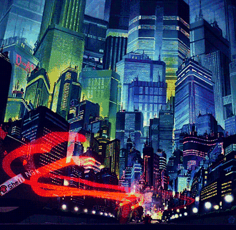
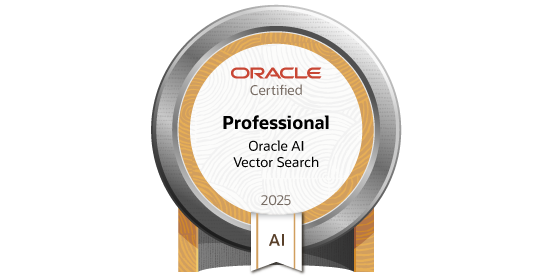
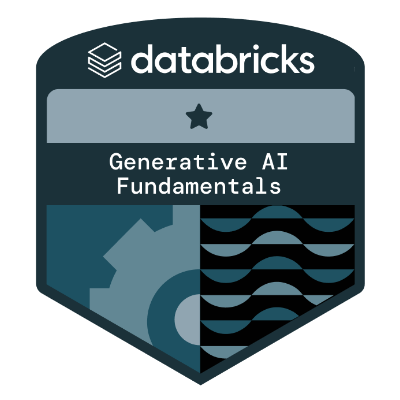

<!-- Header -->

<h1>⚔ こんにちは、私は アジェイ です 🇯🇵</h1>

<em>"Konnichiwa, watashi wa Ajay desu" — Hello, I am Ajay</em>

---
### 🏯 **Who am I（自己紹介）**

| About Me ||
|----------|-------------|
| <ul><li>💼 Final Year CS Graduate</li><li>🧠 Learning: Machine Learning + AI</li><li>💬 Studying Japanese (JLPT N4)</li><li>🥅 2026 Vision: 「日本語 × ML × Backend Mastery」</li></ul><blockquote><em>“努力は裏切らない” — <em>Doryoku wa uragiranai</em> — Effort never betrays.</em></blockquote> |  |

---

### 🌐 **Find Me Online（ソーシャルリンク）**

  

---

### 💻 **My Arsenal（技術スタック）**

---

### 📊 **GitHub Dojo Stats（統計）**

---

### 🥋 **Achievements（実績）**

🏆 **Smart India Hackathon 2023 – Finalist**  
🚀 **Unnat Bharat Abhiyan 2024 – Selected Project**  
🔬 **Research with Nexacrise × Nagoya Institute of Technology**  
🎓 **AI Research: Motor Fault Diagnosis via Acoustic Signals**

---
### 🧧 **Certifications（認定）**

  <!-- Row 1 -->
  

    
    
    
    
  

  <!-- Row 2 -->
  

    
    
    
  

---

### 🏮 **Trophies（トロフィー）**

---

---

### 🏯 **Philosophy（信念）**

> _「完璧ではなく、成長を求めよ」_— Kanpeki de wa naku, seichō o motomeyo  
> *Seek growth, not perfection.*

---

